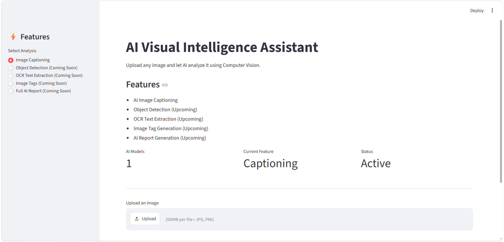
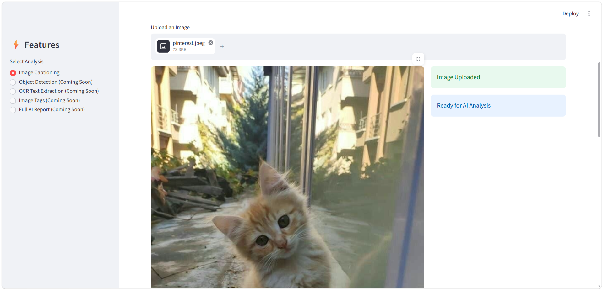
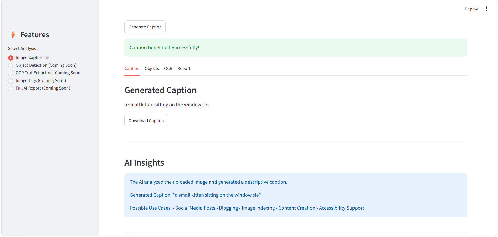

# AI Visual Intelligence Assistant

An AI-powered Computer Vision web application that automatically generates descriptive captions for uploaded images using the BLIP Image Captioning Model from Hugging Face Transformers.

Built with Python, Streamlit, and Deep Learning techniques to provide an interactive image analysis experience through a clean and user-friendly interface.


## Application Preview

### Home Page


### Uploaded Image view


### Caption Generation Result



## Features

- Upload images in JPG, JPEG, and PNG formats
- AI-powered image caption generation
- Interactive dashboard with analysis metrics
- AI-generated image analysis reports
- Download captions as text files
- Download analysis reports
- Fast model loading using Streamlit caching
- User-friendly and responsive interface


## Tech Stack

### Frontend
- Streamlit

### Backend
- Python

### AI / Machine Learning
- Hugging Face Transformers
- BLIP Image Captioning Model
- PyTorch

### Image Processing
- Pillow (PIL)


## Project Structure

```text
AI-Visual-Intelligence-Assistant/
│
├── screenshot.png
├── README.md
├── app.py
└── requirements.txt
```


## Installation & Setup

### 1. Clone the Repository

```bash
git clone https://github.com/YOUR_USERNAME/AI-Visual-Intelligence-Assistant.git
```

### 2. Navigate to the Project Folder

```bash
cd AI-Visual-Intelligence-Assistant
```

### 3. Install Dependencies

```bash
pip install -r requirements.txt
```

### 4. Run the Application

```bash
python -m streamlit run app.py
```


## How It Works

1. User uploads an image.
2. The image is processed using the BLIP Image Captioning Model.
3. The AI generates a descriptive caption based on image content.
4. Results are displayed through an interactive dashboard.
5. Users can download captions and analysis reports.


## Learning Outcomes

This project helped strengthen practical skills in:

- Python Programming
- Computer Vision
- Deep Learning Model Integration
- Hugging Face Transformers
- Streamlit Web Development
- Image Processing
- API and Model Handling


## Future Enhancements

- YOLOv8 Object Detection
- OCR Text Extraction
- Automatic Image Tag Generation
- Multilingual Caption Translation
- Advanced Analytics Dashboard
- PDF Report Generation
- Analysis History Tracking


## Author

**Shrutika Salunke**

B.Tech in Artificial Intelligence  
Usha Mittal Institute of Technology, Mumbai


## Support

If you found this project interesting, consider giving it a star on GitHub.
